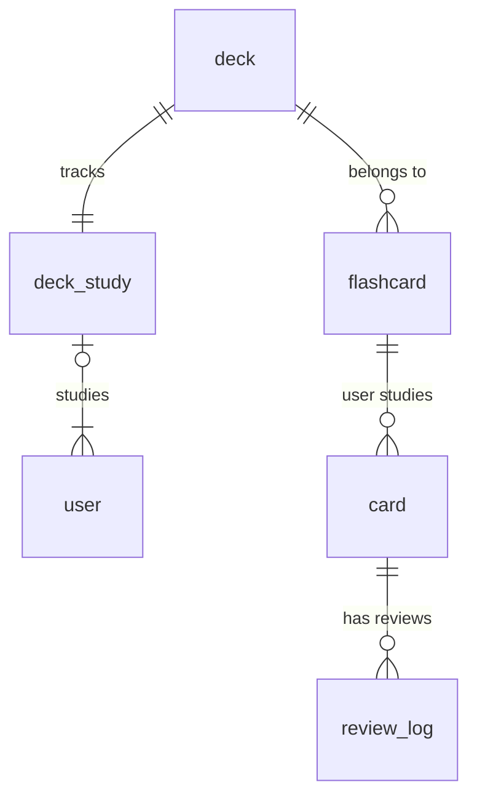

# FSRS Data Model



Challenge: Currently, a `card` is created for a user whenever they create a `flashcard`. The `card` tracks the user's
progress with that `flashcard`, including its `state` (New, Learning, Review) and `due` date for the next review.

The below query retrieves all `card`s for a user that are due for review (i.e., their `due` date is less than or equal
to the current date)

```typescript
const {data: reviewCards, error: reviewError} = await supabase
    .from("flashcard_study")
    .select(
        `
    *,
    flashcard (
      id,
      front,
      back,
      notes
    )
  `,
    )
    .eq("user_id", user.id)
    .neq("state", "New")
    .lte("due", nowStr)
    .order("due", {ascending: true})
    .limit(limit);
```

This works well when the user owns all the `flashcards` they study. However, if we want to support shared `flashcards`
(e.g., a public deck that multiple users can study), we need to adjust our data model.

## Solution

When searching for unstudied `flashcards`, we need to join the `deck_study` table to ensure that we only retrieve
`card`s for `flashcard`s that belong to `deck`s the user is studying.

This would be a naive implementation with the given data model:

```typescript
const {data: unstudiedCards, error: unstudiedError} = await supabase
    .from("flashcard_study")
    .select(`
        *,
        flashcard!inner (
            id,
            front,
            back,
            notes,
            deck!inner (
                deck_study!inner (
                    deck_id,
                    user_id
                )
            )
        )
    `)
    .eq("card.user_id", user.id)
    .eq("flashcard.deck.deck_study.user_id", user.id)
    .eq("state", "New")
    .order("created_at", {ascending: true})
    .limit(limit);
```

To avoid three different inner JOINs, I believe it would be better to reduce complexity by denormalizing the data model
and adding a `deck_id` foreign key directly to the `card` table. This way, we can directly associate each `card`
with the `deck` it belongs to, simplifying queries for both due and unstudied `card`s.

```typescript
// Step 1: Get deck IDs the user is studying
const {data: studyingDecks} = await supabase
    .from("deck_study")
    .select("deck_id")
    .eq("user_id", user.id);

const deckIds = studyingDecks?.map(d => d.deck_id) || [];

// Get due cards from those decks
const {data: reviewCards, error: reviewError} = await supabase
    .from("flashcard_study")
    .select(`
        *,
        flashcard (
            id,
            front,
            back,
            notes
        )
    `)
    .eq("user_id", user.id)
    .neq("state", "New")
    .lte("due", nowStr)
    .in("deck_id", deckIds)
    .order("due", {ascending: true})
    .limit(limit);
```

